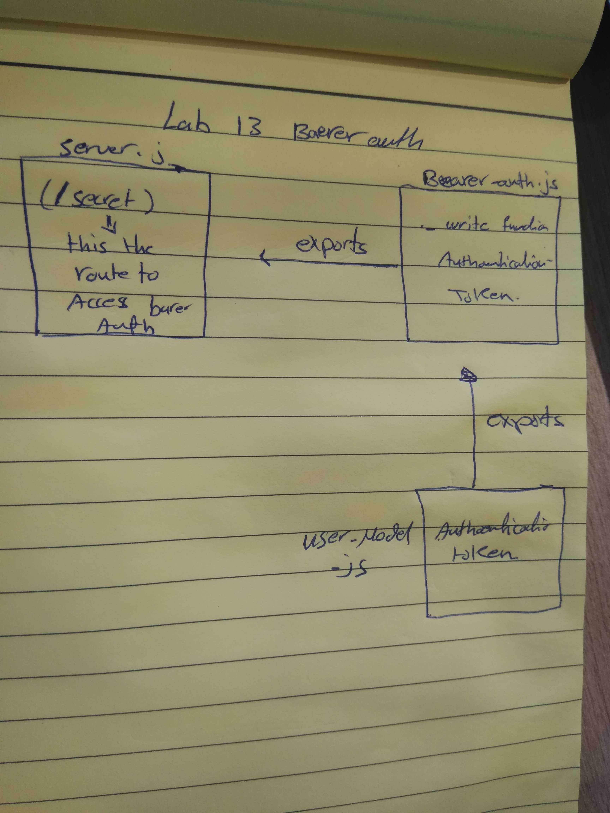

# LAB - Class 14

## ACL

### Author: Muna and Mai 

### Links and Resources

- [submission PR](https://github.com/401-advanced-javascript-muna/lab-12-oauth/pull/2)

#### How to initialize/run your application (where applicable)

-  `node index.js`

#### Tests

without test

- .env file:

PORT=3000
MONGOOSE_URI=mongodb://localhost:27017/dbauth
SECRET=sec123
CLIENT_ID=
CLIENT_SECRET=
API_SERVER=

#### UML

Link to an image of the UML for your application and response to events

   "start":"npm array-shift.js",
    "test": "jest --verbose --coverage",
    "lint": "eslint '**/*.js'"

